 

<picture>
  <source media="(prefers-color-scheme: dark)" srcset="assets/contrib-dark.svg">
  <source media="(prefers-color-scheme: light)" srcset="assets/contrib-light.svg">
  
</picture>

 

<picture>
  <source media="(prefers-color-scheme: dark)" srcset="assets/header-dark.svg">
  <source media="(prefers-color-scheme: light)" srcset="assets/header-light.svg">
  
</picture>

<a href="https://imrozeshan.vercel.app"><picture>
  <source media="(prefers-color-scheme: dark)" srcset="assets/badge-portfolio-dark.svg">
  <source media="(prefers-color-scheme: light)" srcset="assets/badge-portfolio-light.svg">
  
</picture></a>&nbsp;&nbsp;<a href="https://www.linkedin.com/in/imroz-eshan/"><picture>
  <source media="(prefers-color-scheme: dark)" srcset="assets/badge-linkedin-dark.svg">
  <source media="(prefers-color-scheme: light)" srcset="assets/badge-linkedin-light.svg">
  
</picture></a>

 
 

<picture>
  <source media="(prefers-color-scheme: dark)" srcset="assets/stack-dark.svg">
  <source media="(prefers-color-scheme: light)" srcset="assets/stack-light.svg">
  
</picture>

 

